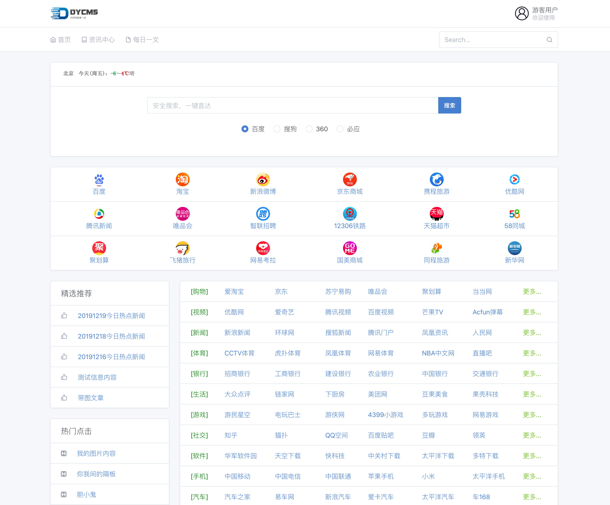
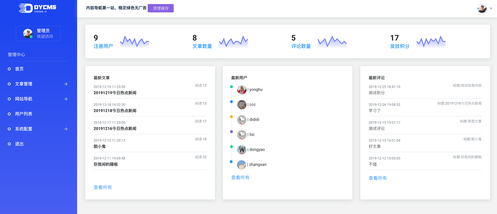

## 关于本网站

- 当前为bate版，请在正式版发布后下载使用!

本站是[网址导航1.0](https://gitee.com/dongyao/web_site_navigation)的重构版本，并将维持长期更新，旧版本将停止更新维护！

#### 使用前确认您的服务器满足以下条件

- PHP >= 7.2.0
- BCMath PHP 拓展
- Ctype PHP 拓展
- JSON PHP 拓展
- Mbstring PHP 拓展
- OpenSSL PHP 拓展
- PDO PHP 拓展
- Tokenizer PHP 拓展
- XML PHP 拓展
- fileinfo PHP 拓展

如果不确定您的服务器是否满足该条件，可添加QQ群：648120877 进行沟通交流！

## 安装说明

本次版本是基于laravel框架基础开发，安装过程中，会大量使用到[composer](https://baike.baidu.com/item/composer/3351208?fr=aladdin) 和 [Git命令](https://baike.baidu.com/item/GIT/12647237) ，以及一些基本的命令行命令，为了方便各位使用，我们会录制一个详细的安装教程来说明！

如果您不需要新版增加的这些功能模块，只需要简单的导航页面的话，推荐您使用第一版[Thinkphp版网址导航](https://gitee.com/dongyao/web_site_navigation)版本的(不再维护);

## 特别鸣谢

这款导航内容网站的制作，离不开网络上其他开源产品的支持，这里特别鸣谢以下开源产品，如果遗漏，请联系我们及时补充.

- **[laravel](https://laravel.com/)**
- **[bootstrap](https://getbootstrap.com/)**
- **[tabler](https://github.com/tabler/tabler)**
- **[PhpSpreadsheet](https://phpspreadsheet.readthedocs.io)**

## 开发计划

- 会员积分模块
- 积分商城模块
- 公众号移植
- 小程序移植
- 支付充值
- 付费内容
- ……
## 版权说明

长期以来，通过开源社区的朋友帮助，从开源平台学习了不少东西，特此开放本套代码，作为对开源平台的一份小贡献，无任何版权限制，如果你是开发新手，也可以借此来当做练手案例，里面都是基础功能运用！

## 升级周期

由于本人工作原因，暂不能保证固定周期更新版本，具体更新时间另行通知！如果您也希望参与这个项目，可以直接私信作者联系相关事宜！

## 版本升级

最新版本会及时更新到版本库，您可手动拉取git最新版即可完成更新：
> git pull 

> composer install

如果您对程序核心进行过手动修改，可能导致git拉取冲突失败，无法成功下载最新版，此时可尝试手动更新

## 友情赞助

## 部分截图演示

