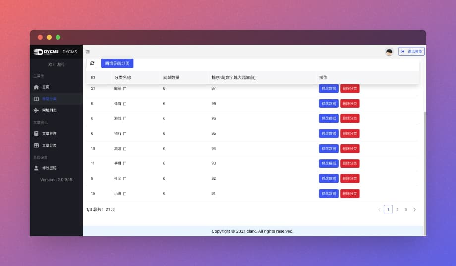

    <h1>DYcms[开发版] - 内容导航平台2.x-测试版</h1>
    
万能后端开发框架 - 测试版问题较多，谨慎使用

      
      
      
      
      
     
    
     
    <!-- 
    
     -->

  

>  `DYCMS`是一款集网址导航，内容发布，用户管理等于一体的综合性网站平台，开发的初衷就是源于目前市面上导航网站混乱，广告插件满天飞，**弱化了导航网站本该具备的功能，全都变成了一个个的导购平台和民间花边新闻网站**(这其中也不乏一些知名大牌网站)，因此开源本套代码，方便各位用于自身需要，或者运营自己的业务使用。

> 随着2.0版本的升级，DYCMS已经不仅仅可以实现网址导航，后续采用模块化结构之后，DYCMS也可以变身博客，企业网站，电商，APP，小程序等等全能型后台架构。

版本库：[ [gitee](https://gitee.com/dongyao/dycms) | [github](https://github.com/dongyao8/dycms)]

> 使用文档：[2.x文档（完善中）](http://docs.dongyao.ren/dycms-docs)

## 后台部分展示
> 前端页面当前正在招募合作伙伴一起完善，欢迎推荐加入！

## 后续开发计划

- [ ] 博客模块
- [ ] 收费阅读
- [ ] 适配小程序
- [ ] [其他意见建议请点击提交issues](https://github.com/dongyao8/dycms/issues)

## 感谢Star

### 官方QQ群：

- DYCMS交流1群 `648120877` 【已满员】
- DYCMS交流2群 `778957856`
> 非常感谢您关注和支持选择DYCMS ^\_^

## 关注微信

不定时更新最新动态，获取最新讯息。

## 友情赞助
> 如果您觉得这个平台对你有帮助，可以通过下方二维码打赏支持一下！

## 免责声明

DYcms程序是免费开源的产品，仅用于学习交流使用！       
不可用于任何违反`中华人民共和国(含台湾省)`或`使用者所在地区`法律法规的用途。      
因为作者即本人仅完成代码的开发和开源活动`(开源即任何人都可以下载使用)`，从未参与用户的任何运营和盈利活动。    
且不知晓用户后续将`程序源代码`用于何种用途，故用户使用过程中所带来的任何法律责任即由用户自己承担。

## License

Apache License 2.0 [Apache License](https://github.com/dongyao8/dycms/blob/master/LICENSE).
